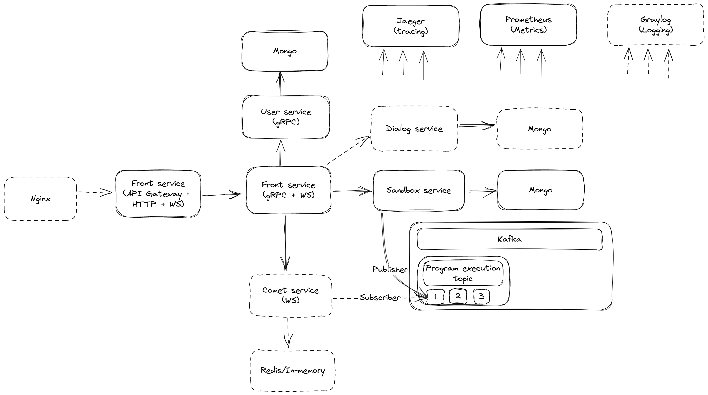

# Abstract

In today's digital age, social networks have become an integral part of our daily lives. They enable us to connect with friends and family, share our thoughts and experiences, and stay up-to-date with the latest news and trends. However, for programmers, social networks also serve as an essential communication tool for sharing and discussing code. That's why a social network that supports programming functionality can speed up the interaction of programmers and, as a result, speed up software development. The goal of the project is to develop a social network specifically for programmers, which has the integration of several development tools and provides its own small ecosystem. With hotkeys that automatically generate a link to view the inserted code, as well as the ability to run, format, and examine linters' comments, messages will not have large chunks of code and the focus of attention will not be lost. And while it currently only supports the Go language, the potential for expansion is limitless.

# Services and their APIs

## Assumptions when calculating non-functional requirements - TODO

* Total users: `1 000 000`
* MAU: `500 000`
* DAU: `50 000`
* Peak hour load: `10 000` per hour

## Auth
| Requirement | Average RPS | Peak RPS |
| ------------ |------------: |------------: |
| Registration | 2.00 | 1000.00 |
| Authorization | 0.50 | 100.00 |

## Actions with users
| Requirement | Average load (requests per hour from one user) | Peak load (requests per hour from one user) | Average RPS | Peak RPS |
| ------------ |------------: |------------: |------------: |------------: |
| Find a user by nickname | 1.00 | 10.00 | 13.89 | 138.89 |
| Show profile | 0.50 | 10.00 | 6.94 | 138.89 |

## Actions with own profile
| Requirement | Average load (requests per hour from one user) | Peak load (requests per hour from one user) | Average RPS | Peak RPS |
| ------------ |------------: |------------: |------------: |------------: |
| Find a user by nickname | 1.00 | 10.00 | 13.89 | 138.89 |
| Show profile | 0.50 | 10.00 | 6.94 | 138.89 |

## Actions with dialogs
| Requirement | Average load (requests per hour from one user) | Peak load (requests per hour from one user) | Average RPS | Peak RPS |
| ------------ |------------: |------------: |------------: |------------: |
| Create dialog | 0.10 | 10.00 | 1.39 | 138.89 |
| Delete dialog | 0.01 | 2.00 | 0.14 | 27.78 |
| Send a message to the dialog | 5.00 | 100.00 | 69.44 | 1388.89 |
| Delete a message from a dialog (for both) | 0.10 | 5.00 | 1.39 | 69.44 |
| Find a message in the dialog | 0.50 | 5.00 | 6.94 | 69.44 |
| Search for a message in all user dialogs | 1.00 | 10.00 | 13.89 | 138.89 |
| View all links to the sandbox in the dialogs | 0.20 | 4.00 | 2.78 | 55.56 |

## Actions with sandbox
| Requirement | Average load (requests per hour from one user) | Peak load (requests per hour from one user) | Average RPS | Peak RPS |
| ------------ |------------: |------------: |------------: |------------: |
| Find code listing | 3.00 | 15.00 | 41.67 | 208.33 |
| Create code listing | 0.50 | 5.00 | 6.94 | 69.44 |
| Update code listing | 0.60 | 4.00 | 8.33 | 55.56 |
| Run code (only Go) | 0.25 | 2.00 | 3.47 | 27.78 |
| Linting code (only Go) | 0.25 | 1.50 | 3.47 | 20.83 |

## User service
| Handler | Average RPS | Peak RPS | Request MAX bytes | Response MAX bytes |
| ------------ |------------: |------------: |------------: |------------: |
| CreateUser | 2.00 | 1000.00 | 2048 | 40 |
| GetUserByID | 14.39 | 238.89 | 40 | 1024 |
| DeleteUserByID | 0.00 | 0.00 | 40 | 4 |
| GenerateToken | 0.50 | 100.00 | 1024 | 2000 |

## User service databse load
| Average R/W ratio | Agerage read RPS | Agerage write RPS | Peak R/W ratio | Peak read RPS | Peak write RPS | Max write GB (per day) | Max write GB (per month) |
| ------------ |------------: |------------: |------------: |------------: |------------: |------------: |------------: |
| 744.44% | 14.89 | 2.00 | 33.89% | 338.89 | 1000.00 | 171.23 | 5136.97 |

## Sandbox service
| Handler | Average RPS | Peak RPS | Request MAX bytes | Response MAX bytes |
| ------------ |------------: |------------: |------------: |------------: |
| CreateProgram | 6.94 | 69.44 | 10000 | 40 |
| GetProgramByID | 41.67 | 208.33 | 40 | 30040 |
| UpdateProgramSource | 8.33 | 55.56 | 10040 | 4 |
| RunProgram | 3.47 | 27.78 | 40 | 4 |
| LintProgram | 3.47 | 20.83 | 40 | 4 |

## Sandbox service databse load
| Average R/W ratio | Agerage read RPS | Agerage write RPS | Peak R/W ratio | Peak read RPS | Peak write RPS | Max write GB (per day) | Max write GB (per month) |
| ------------ |------------: |------------: |------------: |------------: |------------: |------------: |------------: |
| 187.50% | 41.67 | 22.22 | 120.00% | 208.33 | 173.61 | 1.12 | 33.53 |

## TODO:
* Latency
* Performanse
* Persentage of error requests (SLA)
* Fault tolerance - how to deal with errors (reduced functionality - how to discuss someone at least)
* Security
    * confidentiality requirements
    * consider typical attacks
    * network restrictions - perimeter system (describe what works in a closed network)
    * firewall
* Maintainability - Approximate life of the product
* Portability
    * Windows
    * Mac
    * Linux

# System design

* Number of simultaneous connections: `10 000`. Modern servers can hold `10 000` - `100 000` simultaneous connections, so one instance will be enough.
